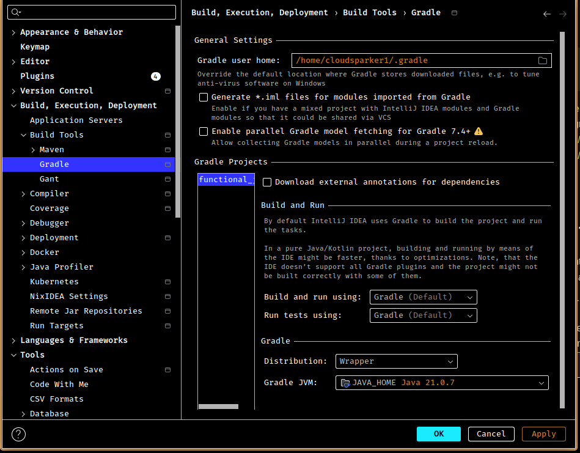

# Learn Functional Java

## AI Assist

- https://developers.google.com/gemini-code-assist/docs/tools-agents/tools-overview

## Nixify

1. `devenv init`
2. enable java with gradle, see 
3. Navigate to Build Tools/Gradle
   1. Set Gradle JVM
4. Mark the following directories as `Mark Excluded` to prevent IJ from indexing them:
   1. .devenv
   2. .direnv
    
5. Restart IJ (There's probably a way to trigger importing Gradle project without a restart 😩)

> 08/13/2025 JDK  
> JDK released every september
> JDK25 is a LTS

- https://www.kousenit.com/java/
- 
- https://github.com/kousen/java_8_recipes
- https://github.com/kousen/java_upgrade
- https://github.com/kousen/java_latest
- http://www.kousenit.com/java/
- https://github.com/kousen/java_upgrade
- [Java Docs](https://docs.oracle.com/en/java/javase/21/docs/api/index.html)
- [Function](https://docs.oracle.com/en/java/javase/21/docs/api/java.base/java/util/function/package-summary.html)

## Vavr.io
> 😱 upside down J A V A
- Immutable datastructures
- Richer datastructures
- Superior error handling

## Production Troubleshooting with JVM Tools

The Java Development Kit (JDK) includes a powerful suite of command-line tools for diagnosing and troubleshooting performance issues in a running Java Virtual Machine (JVM). The four primary tools for live production analysis are `jstat`, `jstack`, `jmap`, and `jfr`.

Think of it like a doctor diagnosing a patient:
*   **`jstat`** is like checking the vital signs (pulse, temperature, blood pressure). It gives you a high-level, real-time overview.
*   **`jstack`** is like an EKG or a neurologist's exam. It tells you what the patient's brain and muscles (threads) are doing *right now*.
*   **`jmap`** is like an MRI or a biopsy. It gives you a detailed, static snapshot of the patient's internal anatomy (memory).
*   **`jfr`** is like a 24-hour Holter monitor combined with a full medical diary. It records a huge range of events over time with very low impact.

---

### 1. `jstat` (JVM Statistics Monitoring Tool)

*   **Core Purpose**: To get a high-level, real-time view of JVM performance, primarily focused on garbage collection (GC) and class-loading activity.
*   **When to Use It**: This is often the **first tool you use** when you suspect a performance problem. Is the application slow? Is the CPU high? `jstat` can quickly tell you if the JVM is spending all its time in garbage collection, a common cause of performance issues.
*   **Production Impact**: **Very low**. It's designed for continuous monitoring and is safe to run frequently in production.
*   **Troubleshooting Scenario**:
    *   **Symptom**: The application is sluggish, and CPU usage is consistently high.
    *   **Action**: Run `jstat -gcutil <PID> 1s` to check GC statistics every second.
    *   **Diagnosis**: You see the "YGC" (Young Generation GC) and "FGC" (Full GC) columns increasing rapidly, and the "GCT" (Total GC Time) is a large percentage of the application's uptime. This tells you the application is "thrashing" the garbage collector, likely due to creating too many short-lived objects or a memory leak forcing constant full GCs.

---

### 2. `jstack` (Java Stack Trace Tool)

*   **Core Purpose**: To inspect the state of all threads within the JVM. It provides a "thread dump," showing what every single thread is doing at that exact moment.
*   **When to Use It**:
    1.  **Application is Unresponsive/Frozen**: This is the primary tool for diagnosing deadlocks. `jstack` will explicitly find and report deadlocked threads.
    2.  **High CPU Usage**: If a specific Java process is consuming 100% of a CPU core, you can use `jstack` to find which thread is responsible and see exactly what code it's executing.
*   **Production Impact**: **Low**. It's a quick, read-only operation that briefly pauses the JVM to ensure a consistent snapshot of all threads. It's generally safe to use in production.
*   **Troubleshooting Scenario**:
    *   **Symptom**: The application has completely stopped processing requests but the process is still running.
    *   **Action**: Run `jstack -l <PID>`.
    *   **Diagnosis**: At the bottom of the output, you see a "Found 1 deadlock" section, which details the two (or more) threads that are stuck waiting on each other's locks. You now know exactly where in the code the deadlock is occurring.

---

### 3. `jmap` (Memory Map Tool)

*   **Core Purpose**: To inspect the objects in the JVM's memory heap.
*   **When to Use It**: When you suspect a memory leak or want to understand what is consuming memory. `jstat` might tell you *that* you have a memory problem, but `jmap` tells you *what* objects are causing it.
*   **Production Impact**: **Varies from low to EXTREMELY HIGH**.
    *   `jmap -histo <PID>`: **Low impact**. It prints a histogram of objects (how many instances of each class, and how much memory they take up). This is often a good first step.
    *   `jmap -dump:live,format=b,file=heap.bin <PID>`: **Very high impact**. This triggers a Full GC and then writes the entire heap to a file. **This will freeze your application for seconds or even minutes**, depending on the heap size. It should be used with extreme caution in production.
*   **Troubleshooting Scenario**:
    *   **Symptom**: `jstat` shows the old generation memory continuously growing and never decreasing, leading to frequent, long Full GCs. This strongly suggests a memory leak.
    *   **Action**: Run `jmap -histo <PID> | head -n 20` to see the top 20 memory consumers.
    *   **Diagnosis**: The histogram shows millions of `com.example.MySessionObject` instances. This tells you that your application is creating session objects but never releasing them, which is the source of your memory leak.

---

### 4. `jfr` (Java Flight Recorder)

*   **Core Purpose**: To collect detailed profiling and diagnostic data from the JVM over time with extremely low overhead. It's the most sophisticated of the tools.
*   **When to Use It**: For complex, intermittent problems that are hard to reproduce. Instead of a single snapshot, JFR gives you a recording of events (GC pauses, lock contention, I/O, CPU usage by method, etc.) leading up to the problem.
*   **Production Impact**: **Very low (by design)**. It's safe to leave JFR running continuously in production environments to capture data about rare events.
*   **Troubleshooting Scenario**:
    *   **Symptom**: Every few hours, the application experiences a 10-second "hiccup" where performance degrades, but it's not a full crash or deadlock, so `jstack` and `jmap` might miss it.
    *   **Action**: You have JFR running continuously. After a hiccup occurs, you dump the recording: `jcmd <PID> JFR.dump name=my_recording filename=recording.jfr`. You then analyze this `recording.jfr` file in a tool like Java Mission Control (JMC).
    *   **Diagnosis**: The JMC analysis shows that during the hiccup, there were long "safepoint" pauses, and the "Lock Contention" view shows that dozens of threads were all waiting for a lock on a single, non-performant logging object. This points you to a bottleneck in your logging configuration that only becomes apparent under specific load conditions.

## In Bits and Bytes

| Type      | Size (Bits) | Size (Bytes)    |
|-----------|-------------|-----------------|
| `byte`    | 8           | 1               |
| `short`   | 16          | 2               |
| `int`     | 32          | 4               |
| `long`    | 64          | 8               |
| `float`   | 32          | 4               |
| `double`  | 64          | 8               |
| `char`    | 16          | 2               |
| `boolean` | 1*          | (JVM Dependant) |

---

*A `boolean` represents one bit of information, but is often stored as a full byte in memory for alignment purposes.*

## Latency Numbers Every Programmer Should Know

| Operation                               | Latency                      |
|:----------------------------------------|:-----------------------------|
| L1 cache reference                      | ~1 nanosecond                |
| Branch mispredict                       | ~3 nanoseconds               |
| L2 cache reference                      | ~4 nanoseconds               |
| Mutex lock/unlock                       | ~20 nanoseconds              |
| **Main memory reference**               | **~100 nanoseconds**         |
| Compress 1 KB with Snappy               | ~1,000 ns (1 µs)             |
| Send 1 KB over 1 Gbps network           | ~10,000 ns (10 µs)           |
| Read 4 KB randomly from SSD             | ~100,000 ns (100 µs)         |
| **Round trip within same datacenter**   | **~500,000 ns (500 µs)**     |
| Read 1 MB sequentially from memory      | ~1,000,000 ns (1 ms)         |
| Read 1 MB sequentially from SSD         | ~1,000,000 ns (1 ms)         |
| **Disk seek (HDD)**                     | **~10,000,000 ns (10 ms)**   |
| Read 1 MB sequentially from HDD         | ~20,000,000 ns (20 ms)       |
| **Send packet CA -> Netherlands -> CA** | **~150,000,000 ns (150 ms)** |

### Powers of 10 (Time Units)

| Unit        | Abbreviation | Equivalent                |
|:------------|:-------------|:--------------------------|
| Nanosecond  | ns           | 1/1,000,000,000 second    |
| Microsecond | µs           | 1,000 ns                  |
| Millisecond | ms           | 1,000 µs (1/1,000 second) |
| Second      | s            | 1,000 ms                  |

### Powers of 2 (Common Data Units)

| Unit     | Abbreviation | Equivalent               |
|:---------|:-------------|:-------------------------|
| Kilobyte | KB           | 2^10 bytes (1,024 bytes) |
| Megabyte | MB           | 2^20 bytes (1,024 KB)    |
| Gigabyte | GB           | 2^30 bytes (1,024 MB)    |
| Terabyte | TB           | 2^40 bytes (1,024 GB)    |
| Petabyte | PB           | 2^50 bytes (1,024 TB)    |   
| Exabyte  | EB           | 2^60 bytes (1,024 PB)    |

| Decimal Prefix (Power of 10) | Value           | Binary Prefix (Power of 2) | Value           | % Difference | 
|:-----------------------------|:----------------|:---------------------------|:----------------|:-------------| 
| Kilobyte (KB)                | 10³ = 1,000     | Kibibyte (KiB)             | 2¹⁰ = 1,024     | 2.4%         | 
| Megabyte (MB)                | 10⁶ = 1,000,000 | Mebibyte (MiB)             | 2²⁰ = 1,048,576 | 4.8%         | 
| Gigabyte (GB)                | 10⁹             | Gibibyte (GiB)             | 2³⁰             | 7.4%         | 
| Terabyte (TB)                | 10¹²            | Tebibyte (TiB)             | 2⁴⁰             | 10.0%        | 
| Petabyte (PB)                | 10¹⁵            | Pebibyte (PiB)             | 2⁵⁰             | 12.6%        | 
| Exabyte (EB)                 | 10¹⁸            | Exbibyte (EiB)             | 2⁶⁰             | 15.3%        |